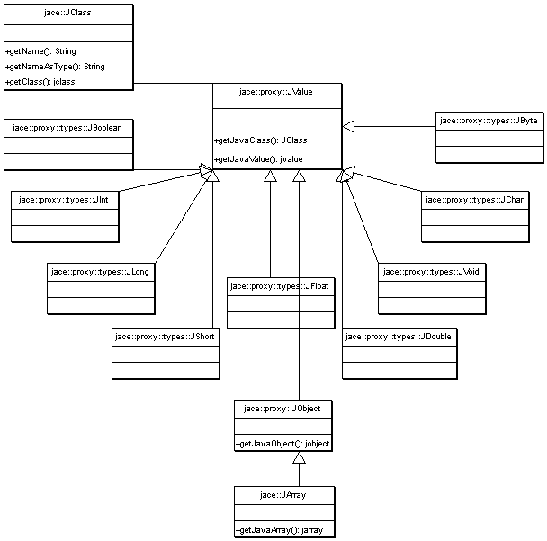

# Chapter 3
## Proxy Classes


### Here a Proxy, There a Proxy, Everywhere a Proxy Proxy

Jace C++ Proxies are C++ classes that wrap existing Java types. If you examine the JNI type system, you'll see that there are a
total of 24 different types.

nine primitive types:

* jboolean
* jbyte
* jchar
* jshort
* jint
* jlong
* jdouble
* jfloat
* void

fourteen reference types:

* jobject
* jclass
* jstring
* jthrowable
* jarray
* jobjectArray
* jbooleanArray
* jbyteArray
* jcharArray
* jshortArray
* jintArray
* jlongArray
* jfloatArray
* jdoubleArray

and the union type:

* jvalue

which can represent any of the primitive or reference types.

Jace models each JNI type with a corresponding C++ class as can be seen in Figure 1.



At the root of the class hierarchy is JValue which is the base class for every type in the
system<a id="note1ref" href="#note1"><sup>1</sup></a>. A JValue is mostly a simple wrapper around a JNI jvalue. Every JValue has
a JClass which can be used to retrieve the JNI string which represents itself<a id="note1ref" href="#note1"><sup>2</sup></a>
and the JNI jclass that represents the Java type. JValues can be constructed with a JNI jvalue, and the JValue base class sets the
rule that all of its subclasses must also be constructible with a jvalue.

Directly subclassing JValue, are the nine primitive Proxies. Primitive Proxies are simple wrappers around Java primitives, with convenient methods and overloaded operators to provide easy conversion with C++ primitives. The primitive Proxies can be instantiated from their matching JNI types or from their corresponding C++ types. For example, you can create a new JInt using a C++ int, or using a JNI jint:

```c++
jint jniInt = 32;
JInt fromJniInt( jniInt );
JInt fromCppInt( 32 ); 
```

Also subclassing JValue is JObject, the root of all Java reference types. JObject is a wrapper around the JNI jobject type, and as such, provides access to its JNI jobject, through the getLocalObject() method. Like JValues, JObjects can be constructed from jvalues, but they can also be constructed from jobjects. And also like JValue, JObject sets a rule for all of its base classes - only this time, the children must be constructible from a jobject as well as a jvalue. Differing from it's simpler ancestors and brethern, JObject has some added capabilities. First, when a JObject is constructed, it creates a new global reference to its jobject. You can access that global reference with a call to getJavaObject(). Second, you can test a JObject to see if it is null by calling, isNull().

Subclassing JObject, is the template array class, JArray. The JArray class is a wrapper for all of the JNI array types: jarray, jobjectArray, jbooleanArray, jbyteArray, jcharArray, jshortArray, jintArray, jlongArray, jfloatArray, and jdoubleArray. The JArray class can take any Proxy class as a template parameter. You can construct a JArray either by passing it a JNI array or by specifying a size. For example,

```c++
void printLength( jintArray array ) {
  JArray<JInt> intArray( array );
  cout << intArray.length() << endl;
}

JArray<URL> createNewURLArrayOfLength( int length ) {
  JArray<URL> array( length );
  return array;
} 
```

Like its Java counterpart, you can access elements of a JArray by using operator[](). For example,

```java
void printArray( JArray<String> array ) {
  for ( int i = 0; i < array.length(); ++i ) {
  String str = array[ i ];
  cout << str << endl;
  }
} 
```

<a id="note1" href="#note1ref"><sup>1</sup></a> Except JClass

<a id="note2" href="#note2ref"><sup>2</sup></a> For example, the JClass for JInt returns "I", and the JClass for
jace::proxy::java::lang::String returns "java/lang/String;"

----
[Previous page](Chapter_2.md) - [Next page](Chapter_4.md)
